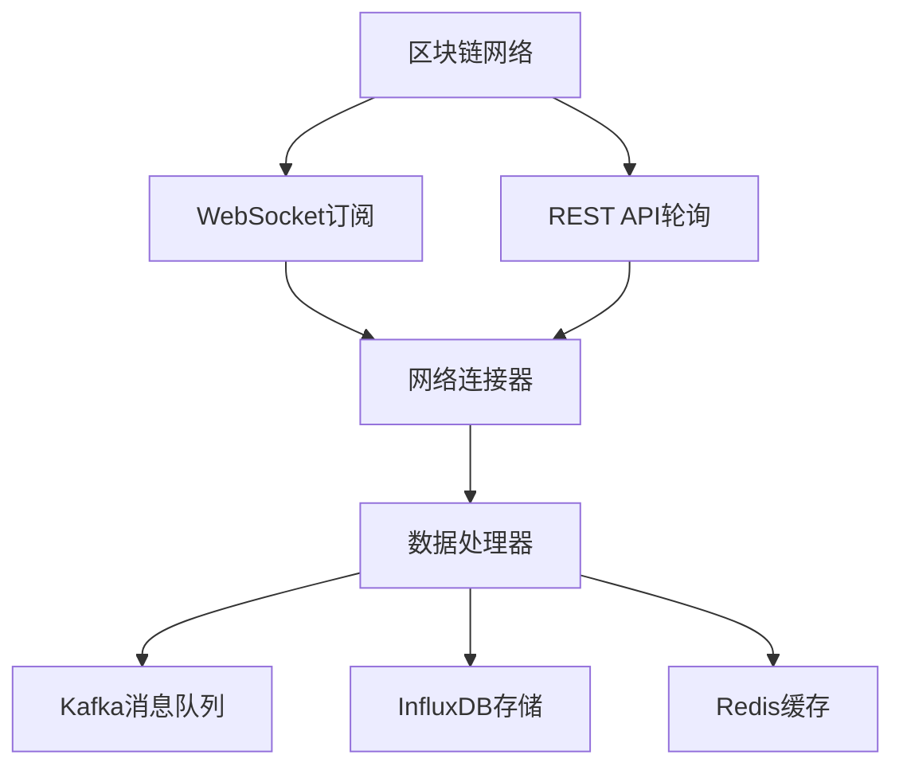
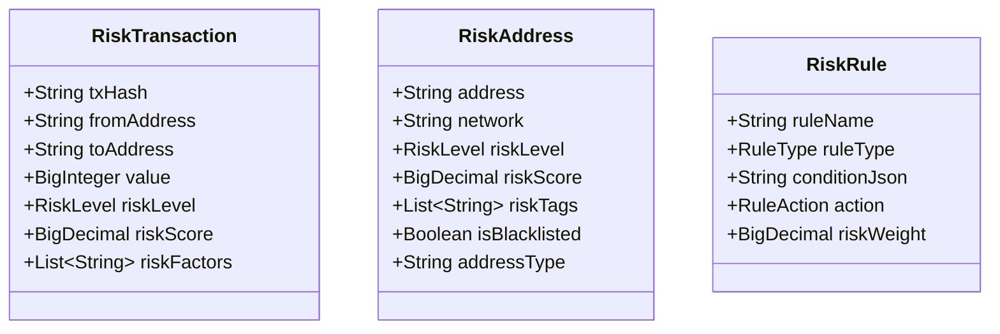
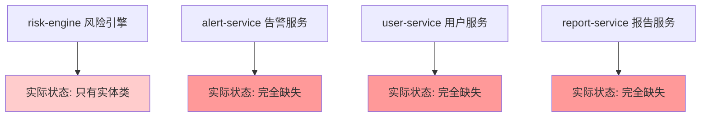
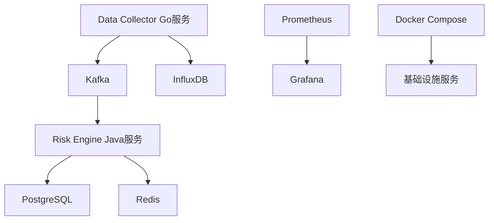
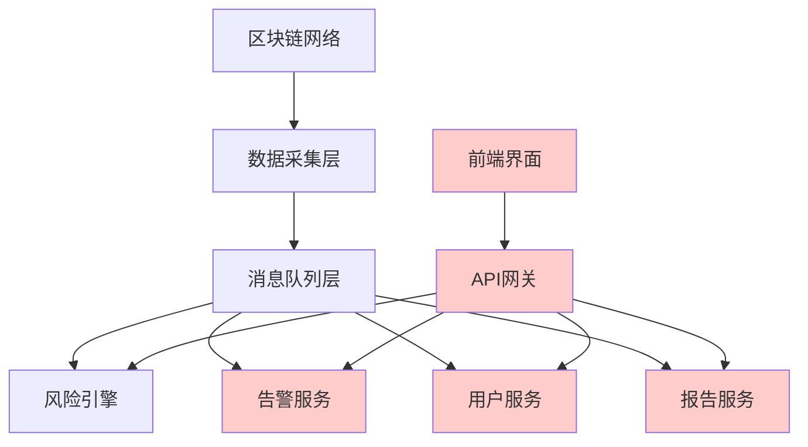

# Web3区块链风控监控平台功能实现检查报告

## 项目概述

本报告对比分析了README.md中描述的功能需求与当前代码库的实际实现情况，识别已实现、部分实现和缺失的功能模块。

## 项目架构分析

### 已实现的技术栈
- ✅ **后端服务**: Java 17 + Spring Boot 3.x (已配置)
- ✅ **数据采集**: Go + go-ethereum (已实现基础框架)
- ❌ **前端界面**: React 18 + TypeScript + Ant Design (未发现实现)
- ✅ **数据库**: PostgreSQL + Redis + InfluxDB (已配置)
- ✅ **消息队列**: Apache Kafka (已配置)
- ✅ **容器化**: Docker + Docker Compose (已配置)
- ✅ **监控**: Prometheus + Grafana (已配置)

## 功能模块实现状况

### 1. 实时区块链数据采集与监控

#### 实现状况: 🟡 部分实现 (70%)

**已实现功能:**
- ✅ 多链架构支持 (以太坊、BSC、Polygon)
- ✅ WebSocket实时订阅机制
- ✅ REST API轮询备用机制
- ✅ 网络连接器抽象层
- ✅ 数据标准化处理框架
- ✅ 指标收集和监控

**部分实现功能:**
- 🟡 事件日志监听 (框架已存在，具体实现不完整)
- 🟡 数据去重机制 (基础Redis支持，算法需完善)
- 🟡 异常过滤 (基础框架存在)
- 🟡 数据质量监控 (指标框架存在)

**缺失功能:**
- ❌ Arbitrum等其他链支持
- ❌ 内存池监控和预警
- ❌ 批量处理优化
- ❌ 连接池高级管理



### 2. 智能风险识别与评估

#### 实现状况: 🟡 部分实现 (60%)

**已实现功能:**
- ✅ 基础风险检测框架
- ✅ 黑名单地址检测
- ✅ 大额交易监控
- ✅ 可疑合约检测
- ✅ 异常Gas费用检测
- ✅ 风险评分算法
- ✅ 多级风险等级分类

**部分实现功能:**
- 🟡 制裁名单检查 (框架存在，数据源需接入)
- 🟡 混币器检测 (基础逻辑存在)
- 🟡 钓鱼地址识别 (依赖外部数据源)
- 🟡 智能合约安全扫描 (基础框架)

**缺失功能:**
- ❌ 机器学习异常检测模型
- ❌ 复杂交易行为模式识别
- ❌ 重入攻击检测
- ❌ 跨链资金追踪
- ❌ 高级统计分析算法

### 3. 告警管理与通知系统

#### 实现状况: 🟡 部分实现 (40%)

**已实现功能:**
- ✅ Kafka消息队列支持
- ✅ 多级别告警框架
- ✅ 配置化告警规则
- ✅ 基础告警生成

**缺失功能:**
- ❌ 5秒内实时告警处理
- ❌ 多渠道通知(邮件、短信、微信、Webhook)
- ❌ 告警状态跟踪
- ❌ 处理结果反馈
- ❌ 告警升级机制
- ❌ 误报学习功能

### 4. 交易行为深度分析

#### 实现状况: 🔴 基础实现 (30%)

**已实现功能:**
- ✅ 基础交易数据模型
- ✅ 简单异常检测逻辑

**缺失功能:**
- ❌ 用户行为画像分析
- ❌ 机器学习异常检测模型
- ❌ 地址关系图谱分析
- ❌ 资金流向网络构建
- ❌ 团伙识别算法
- ❌ 时间序列分析
- ❌ 统计学分析模型

### 5. 资金流向追踪系统

#### 实现状况: 🔴 未实现 (10%)

**已实现功能:**
- ✅ 基础交易数据收集

**缺失功能:**
- ❌ 可视化资金流向图
- ❌ 交互式多层级传播路径
- ❌ 混币器追踪算法
- ❌ 跨链桥监控
- ❌ DEX路径还原
- ❌ FATF规则合规检查
- ❌ AML评估功能
- ❌ KYC验证集成

### 6. 风险报告与分析

#### 实现状况: 🔴 未实现 (20%)

**已实现功能:**
- ✅ Prometheus + Grafana监控基础设施
- ✅ 基础API框架

**缺失功能:**
- ❌ 实时风险仪表盘
- ❌ 定期风险报告生成
- ❌ 自定义分析工具
- ❌ 数据导出功能
- ❌ 风险趋势图表
- ❌ 行业对比分析

## Backend Java服务详细实现分析

### 当前backend实现状况: 🔴 严重不完整 (25%)

#### 已实现组件 ✅

**1. 基础框架配置**
- ✅ Spring Boot 3.2.0 + Java 17 基础架构
- ✅ Maven项目配置和依赖管理
- ✅ 数据库配置 (PostgreSQL + JPA + Druid连接池)
- ✅ 缓存配置 (Redis + Spring Cache)
- ✅ 消息队列配置 (Kafka + Spring Kafka)
- ✅ 监控配置 (Actuator + Prometheus + Swagger)
- ✅ 安全配置 (Spring Security)

**2. 数据模型层**
- ✅ **RiskTransaction** - 完整的交易风险评估实体
- ✅ **RiskAddress** - 完整的地址风险档案实体  
- ✅ **RiskRule** - 完整的风险规则配置实体



#### 缺失的关键业务层 ❌

**1. 完全缺失的包结构:**
- ❌ `controller` 包 - REST API控制器
- ❌ `service` 包 - 业务逻辑服务层
- ❌ `repository` 包 - 数据访问层
- ❌ `dto` 包 - 数据传输对象
- ❌ `config` 包 - 配置类
- ❌ `kafka` 包 - Kafka消息处理
- ❌ `scheduler` 包 - 定时任务
- ❌ `util` 包 - 工具类

**2. 核心业务功能缺失:**
- ❌ 风险评估服务 (RiskAssessmentService)
- ❌ 规则引擎服务 (RuleEngineService)
- ❌ 黑名单管理服务 (BlacklistService)
- ❌ 交易分析服务 (TransactionAnalysisService)
- ❌ 地址分析服务 (AddressAnalysisService)
- ❌ Kafka消息消费者 (TransactionConsumer)
- ❌ REST API控制器 (RiskController)

**3. 技术支撑功能缺失:**
- ❌ 数据库Repository接口
- ❌ 缓存管理服务
- ❌ 配置管理类
- ❌ 异常处理器
- ❌ 数据验证器
- ❌ 定时任务调度

### 对比README期望的服务架构

根据README描述，应该有以下独立服务:



### 关键功能实现度评估

| 功能模块 | 期望实现 | 实际状态 | 实现度 |
|---------|----------|----------|--------|
| 实体模型 | ✅ 完整数据模型 | ✅ 已实现 | 90% |
| 业务服务层 | ✅ 核心业务逻辑 | ❌ 完全缺失 | 0% |
| 数据访问层 | ✅ Repository接口 | ❌ 完全缺失 | 0% |
| REST API | ✅ 完整API接口 | ❌ 完全缺失 | 0% |
| 消息处理 | ✅ Kafka集成 | ❌ 完全缺失 | 0% |
| 配置管理 | ✅ 配置类 | 🟡 基础配置 | 30% |
| 告警服务 | ✅ 独立服务 | ❌ 完全缺失 | 0% |
| 用户服务 | ✅ 独立服务 | ❌ 完全缺失 | 0% |
| 报告服务 | ✅ 独立服务 | ❌ 完全缺失 | 0% |

### backend实现缺口分析

#### 必需立即实现的组件

**1. risk-engine核心功能 (高优先级)**
```java
// 必需的包结构
com.web3.risk.controller.RiskController
com.web3.risk.service.RiskAssessmentService
com.web3.risk.service.RuleEngineService
com.web3.risk.repository.RiskTransactionRepository
com.web3.risk.repository.RiskAddressRepository
com.web3.risk.kafka.TransactionConsumer
com.web3.risk.dto.RiskAssessmentDto
```

**2. 独立微服务 (中优先级)**
- alert-service项目结构
- user-service项目结构  
- report-service项目结构

**3. 集成功能 (低优先级)**
- 服务间通信机制
- API网关配置
- 统一配置管理

## 缺失的后端服务模块

根据README描述，以下服务模块完全缺失:

### 未实现的服务模块
- ❌ **alert-service** (告警服务) - 完全缺失项目
- ❌ **user-service** (用户服务) - 完全缺失项目
- ❌ **report-service** (报告服务) - 完全缺失项目
- ❌ **frontend** (React前端应用) - 完全缺失项目

### 数据采集子模块
当前只有基础实现，缺失:
- ❌ **blockchain-connector** (专门的区块链连接器)
- ❌ **message-publisher** (独立的消息发布器)

## 架构完整性分析

### 当前架构图


### 目标架构缺口


## 配置完整性评估

### 已配置组件
- ✅ Spring Boot应用配置完整
- ✅ 数据库连接配置完整
- ✅ Kafka集成配置完整
- ✅ Redis集成配置完整
- ✅ Docker容器编排配置完整
- ✅ Prometheus监控配置完整

### 配置缺口
- ❌ 外部API接入配置(区块链节点API密钥)
- ❌ 告警通知渠道配置
- ❌ 前端环境配置
- ❌ 生产环境安全配置

## 功能实现优先级建议

### 高优先级 (立即实施)
1. **前端界面开发** - 必需的用户交互界面
2. **告警服务** - 核心安全功能
3. **完善风险检测算法** - 核心业务逻辑

### 中优先级 (短期实施)  
1. **用户服务** - 身份认证和权限管理
2. **报告服务** - 数据分析和可视化
3. **资金流向追踪** - 高级分析功能

### 低优先级 (长期规划)
1. **机器学习模型集成** - 智能分析增强
2. **多语言支持** - 国际化功能
3. **高级性能优化** - 系统扩展性

## 总体实现度评估

| 功能模块 | 实现度 | 状态 | 主要问题 |
|---------|--------|------|----------|
| 基础架构 | 85% | 🟢 良好 | Docker配置完整 |
| Backend框架 | 60% | 🟡 框架完整 | 缺少业务逻辑层 |
| 数据模型 | 90% | 🟢 完整 | 实体设计优秀 |
| 业务服务层 | 0% | 🔴 完全缺失 | 无任何Service实现 |
| API控制器 | 0% | 🔴 完全缺失 | 无REST API |
| 数据访问层 | 0% | 🔴 完全缺失 | 无Repository实现 |
| 数据采集 | 70% | 🟡 部分实现 | Go服务基础完整 |
| 风险识别 | 25% | 🔴 仅有框架 | 缺少完整算法 |
| 告警系统 | 5% | 🔴 配置存在 | 服务完全缺失 |
| 行为分析 | 10% | 🔴 仅有模型 | 分析逻辑缺失 |
| 资金追踪 | 0% | 🔴 未开始 | 完全未实现 |
| 报告分析 | 10% | 🔴 仅有基础设施 | 服务逻辑缺失 |
| 前端界面 | 0% | 🔴 缺失 | 完全未开始 |
| 微服务架构 | 15% | 🔴 架构不完整 | 缺少3个核心服务 |

**总体实现度: 约30%** (之前评估45%过于乐观)

### 关键发现

#### ✅ 已完成的优势
1. **数据模型设计优秀** - 实体类设计完整且考虑周全
2. **技术栈配置完整** - Spring Boot + 中间件配置无误
3. **Go数据采集基础扎实** - 区块链数据采集框架完整
4. **基础设施配置完善** - Docker + 监控配置齐全

#### 🔴 严重缺失的核心组件
1. **无任何业务逻辑实现** - 纯框架项目状态
2. **缺少3个独立微服务** - alert/user/report服务
3. **无API接口** - 无法对外提供服务
4. **无前端界面** - 用户无法交互
5. **数据处理管道断裂** - Go采集到Java处理链路不通

#### 📋 实施建议

**第一阶段 (立即实施):**
1. 实现risk-engine核心业务逻辑
2. 建立完整的数据访问层
3. 提供基础REST API
4. 实现Kafka消息消费

**第二阶段 (短期规划):**
1. 开发alert-service独立服务
2. 建立基础前端框架
3. 完善数据采集到风险评估的完整流程

**第三阶段 (中期规划):**
1. 实现user-service和report-service
2. 完整前端功能开发
3. 高级分析功能实现