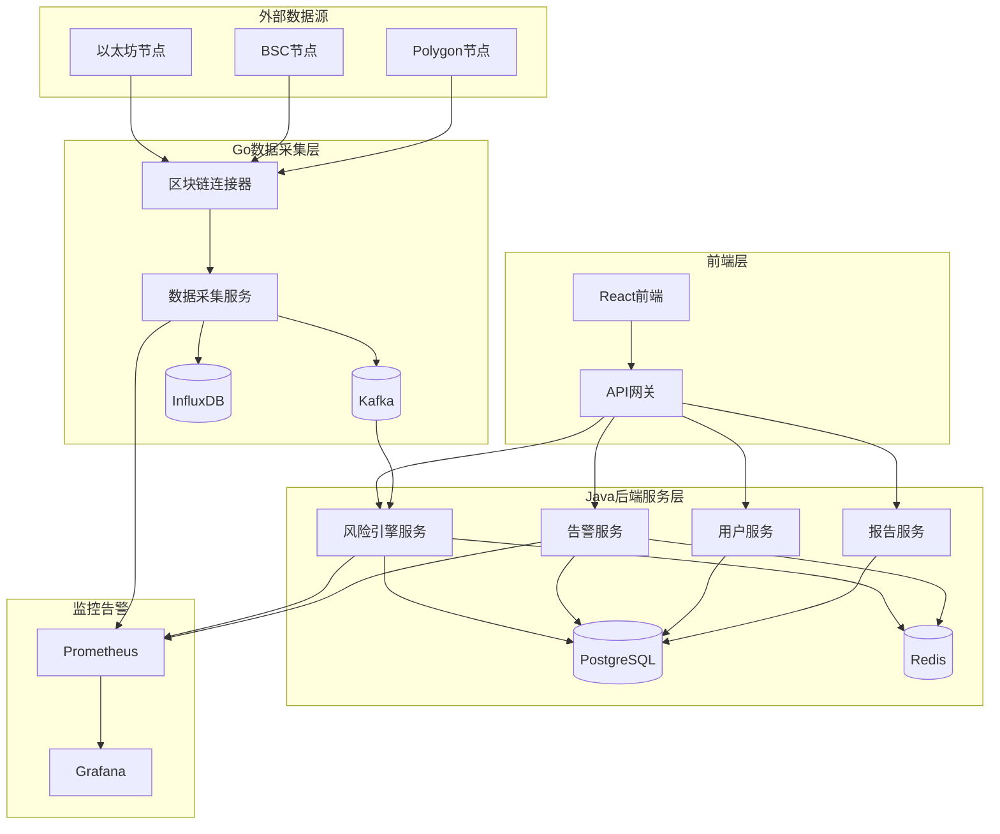
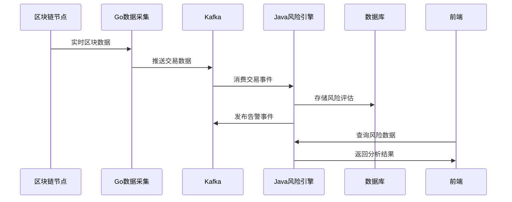
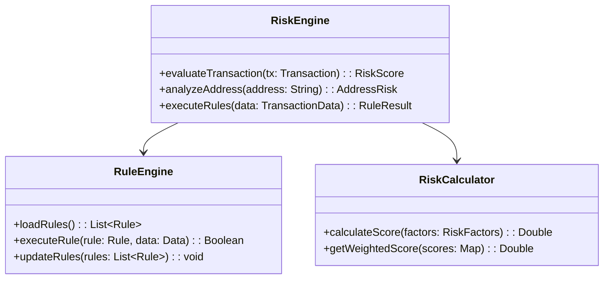
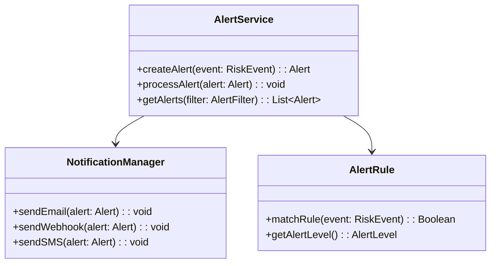
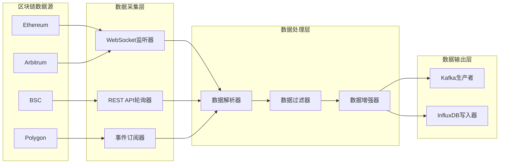
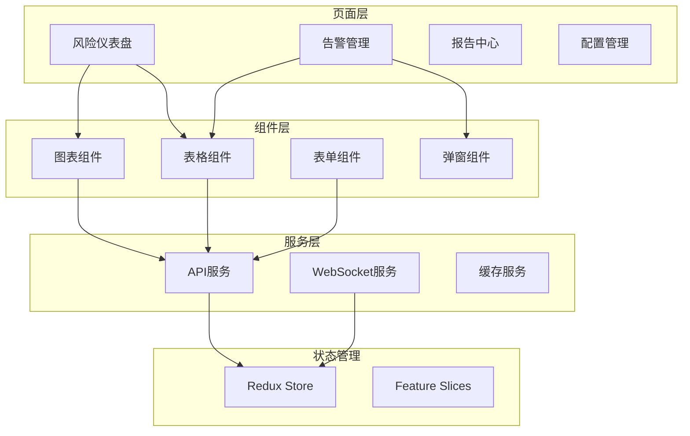
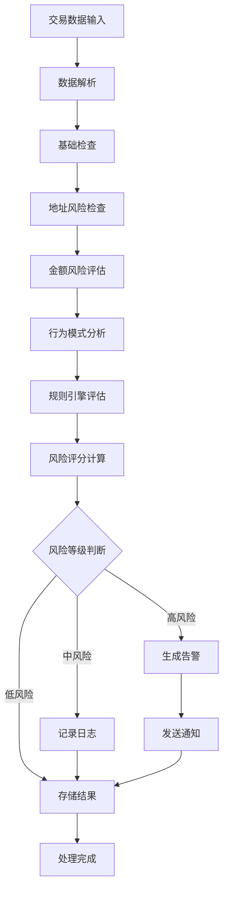
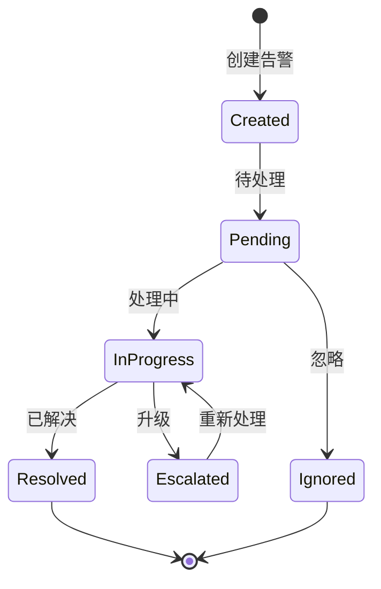

# Web3区块链风控监控平台设计文档

## 概述

本项目是一个基于Java和Go语言的Web3区块链风控监控平台，主要用于实时监控区块链交易、识别潜在风险、生成告警和提供可视化分析。项目采用微服务架构，Java负责核心业务逻辑，Go负责高性能数据采集和处理。

### 核心功能模块

#### 1. 实时区块链数据采集与监控
**1.1 多链数据采集**
- 以太坊主网实时交易监控
- BSC(币安智能链)交易数据采集
- Polygon网络数据同步
- Arbitrum L2网络监控
- 自定义RPC节点接入

**1.2 数据采集策略**
- WebSocket实时订阅新区块
- REST API轮询历史数据
- 事件日志(Event Log)监听
- 内存池(Mempool)交易预警
- 智能合约调用监控

**1.3 数据处理与清洗**
- 交易数据标准化处理
- 重复数据去重机制
- 异常数据过滤
- 数据完整性校验
- 实时数据质量监控

#### 2. 智能风险识别与评估
**2.1 地址风险评估**
- 黑名单地址识别
- 高风险交易所地址标记
- 混币器地址检测
- 勒索软件地址识别
- 钓鱼网站关联地址
- 制裁名单地址匹配

**2.2 交易行为风险分析**
- 大额交易异常检测(>$100万)
- 频繁小额交易识别(疑似洗钱)
- 异常时间交易监控(非正常时段)
- 跨链资金转移追踪
- 多签钱包异常操作
- Gas费异常分析

**2.3 智能合约风险检测**
- 合约代码安全扫描
- 合约权限过度集中检测
- 后门函数识别
- 重入攻击风险评估
- 闪电贷攻击模式识别
- DeFi协议风险评级

**2.4 资金流向风险评估**
- 资金链路追踪分析
- 多跳转账行为识别
- 资金聚集模式检测
- 分散转账模式识别
- 交易所充值异常监控
- 冷热钱包转移监控

#### 3. 告警管理与通知系统
**3.1 实时告警触发**
- 高危交易即时告警(5秒内)
- 大额资金转移告警
- 黑名单地址交互告警
- 智能合约漏洞利用告警
- DeFi协议攻击告警
- 异常Gas费使用告警

**3.2 告警级别管理**
- 紧急告警(Critical): 确认的恶意行为
- 高风险告警(High): 高度可疑活动
- 中风险告警(Medium): 需要关注的异常
- 低风险告警(Low): 轻微异常提醒
- 信息告警(Info): 一般信息通知

**3.3 多渠道通知机制**
- 邮件通知(支持HTML模板)
- 短信告警(紧急情况)
- 微信企业号推送
- Slack/钉钉机器人通知
- Webhook接口调用
- 移动APP推送通知

**3.4 告警处理流程**
- 告警接收确认机制
- 告警处理状态跟踪
- 处理结果反馈
- 告警升级机制
- 误报标记与学习
- 告警统计分析

#### 4. 交易行为深度分析
**4.1 用户行为画像**
- 交易频率模式分析
- 交易金额分布统计
- 活跃时间段分析
- 交易对手方分析
- 偏好代币种类统计
- 风险承受能力评估

**4.2 异常行为检测**
- 机器学习异常检测模型
- 统计学异常值识别
- 时间序列异常分析
- 图神经网络关系分析
- 聚类分析异常群体
- 序列模式挖掘

**4.3 关联分析**
- 地址关联关系图谱
- 资金流向网络分析
- 交易时间关联性
- 相似行为模式识别
- 团伙作案模式发现
- 跨平台行为关联

#### 5. 资金流向追踪系统
**5.1 资金链路可视化**
- 交互式资金流向图
- 多层级资金传播路径
- 时间轴资金流动展示
- 关键节点标识
- 资金池汇聚分析
- 终端地址识别

**5.2 深度追踪功能**
- 多跳转账路径重构
- 混币器前后资金追踪
- 跨链桥资金流向
- DEX交易路径还原
- 闪电贷资金循环分析
- 套利资金流向分析

**5.3 合规性检查**
- FATF旅行规则合规检查
- AML(反洗钱)风险评估
- KYC关联地址验证
- 制裁名单交叉验证
- 司法冻结地址监控
- 监管报告生成

#### 6. 风险报告与分析
**6.1 实时风险仪表盘**
- 当前风险级别总览
- 实时交易监控面板
- 风险趋势图表
- 关键指标KPI展示
- 热点事件追踪
- 网络健康状况

**6.2 定期风险报告**
- 日度风险分析报告
- 周度趋势分析报告
- 月度综合风险评估
- 季度行业对比分析
- 年度风险回顾报告
- 专项调查报告

**6.3 自定义分析工具**
- 自定义查询构建器
- 灵活的数据筛选器
- 多维度数据透视表
- 自定义图表生成
- 报告模板管理
- 数据导出功能(Excel/PDF/CSV)

### 技术栈
- **后端服务**: Java 17 + Spring Boot 3.x
- **数据采集**: Go + Gin + go-ethereum
- **前端界面**: React 18 + TypeScript + Ant Design
- **数据库**: PostgreSQL + Redis + InfluxDB
- **消息队列**: Apache Kafka
- **容器化**: Docker + Docker Compose
- **监控**: Prometheus + Grafana

## 项目架构

### 整体架构图



### 数据流架构



## 后端服务架构

### 服务模块设计

#### 1. 风险引擎服务 (Risk Engine Service)

**核心职责**:
- 交易风险评估
- 地址风险分析
- 规则引擎执行
- 风险评分计算

**主要组件**:



**数据模型**:

| 表名 | 字段 | 类型 | 说明 |
|------|------|------|------|
| risk_transactions | id, tx_hash, from_address, to_address, amount, risk_score, risk_level, created_at | BIGINT, VARCHAR, VARCHAR, VARCHAR, DECIMAL, DOUBLE, VARCHAR, TIMESTAMP | 交易风险记录 |
| risk_addresses | id, address, risk_level, risk_score, risk_tags, updated_at | BIGINT, VARCHAR, VARCHAR, DOUBLE, JSON, TIMESTAMP | 地址风险档案 |
| risk_rules | id, rule_name, rule_type, condition_json, action, enabled, created_at | BIGINT, VARCHAR, VARCHAR, JSON, VARCHAR, BOOLEAN, TIMESTAMP | 风险规则配置 |

#### 2. 告警服务 (Alert Service)

**核心职责**:
- 风险事件告警
- 告警规则管理
- 通知渠道管理
- 告警统计分析

**组件设计**:



#### 3. 用户服务 (User Service)

**核心职责**:
- 用户认证授权
- 权限管理
- 用户配置管理

#### 4. 报告服务 (Report Service)

**核心职责**:
- 风险报告生成
- 数据统计分析
- 导出功能

### API设计

#### 风险评估API

```yaml
/api/v1/risk/evaluate:
  post:
    summary: 评估交易风险
    requestBody:
      content:
        application/json:
          schema:
            type: object
            properties:
              txHash: string
              fromAddress: string
              toAddress: string
              amount: number
              network: string
    responses:
      200:
        description: 风险评估结果
        content:
          application/json:
            schema:
              type: object
              properties:
                riskScore: number
                riskLevel: string
                riskFactors: array
```

#### 告警管理API

```yaml
/api/v1/alerts:
  get:
    summary: 获取告警列表
    parameters:
      - name: level
        in: query
        schema:
          type: string
      - name: status
        in: query
        schema:
          type: string
    responses:
      200:
        description: 告警列表
```

## Go数据采集服务

### 数据采集架构



### 核心组件

#### 1. 区块链连接器

```go
type BlockchainConnector interface {
    Connect(config NetworkConfig) error
    SubscribeNewBlocks() <-chan Block
    SubscribeTransactions() <-chan Transaction
    GetTransactionByHash(hash string) (Transaction, error)
    GetBalance(address string) (*big.Int, error)
}
```

#### 2. 数据处理器

```go
type DataProcessor interface {
    ProcessBlock(block Block) error
    ProcessTransaction(tx Transaction) error
    FilterTransaction(tx Transaction) bool
    EnrichTransactionData(tx *Transaction) error
}
```

#### 3. 消息发布器

```go
type MessagePublisher interface {
    PublishTransaction(tx Transaction) error
    PublishAlert(alert Alert) error
    PublishMetrics(metrics Metrics) error
}
```

### 数据模型

#### 交易数据结构

```go
type Transaction struct {
    Hash          string    `json:"hash"`
    BlockNumber   uint64    `json:"blockNumber"`
    FromAddress   string    `json:"from"`
    ToAddress     string    `json:"to"`
    Value         *big.Int  `json:"value"`
    GasPrice      *big.Int  `json:"gasPrice"`
    GasUsed       uint64    `json:"gasUsed"`
    Timestamp     time.Time `json:"timestamp"`
    Network       string    `json:"network"`
    Status        int       `json:"status"`
    ContractCall  bool      `json:"contractCall"`
    TokenTransfer bool      `json:"tokenTransfer"`
}
```

## 前端架构

### 组件架构



### 核心页面设计

#### 1. 风险仪表盘
- 实时交易监控
- 风险指标展示
- 趋势图表分析
- 热点地址统计

#### 2. 告警管理
- 告警列表展示
- 告警详情查看
- 告警处理流程
- 告警规则配置

#### 3. 报告中心
- 风险报告生成
- 数据导出功能
- 历史报告查看
- 自定义报告模板

## 数据库设计

### PostgreSQL核心表结构

#### 交易风险表
```sql
CREATE TABLE risk_transactions (
    id BIGSERIAL PRIMARY KEY,
    tx_hash VARCHAR(66) UNIQUE NOT NULL,
    block_number BIGINT NOT NULL,
    from_address VARCHAR(42) NOT NULL,
    to_address VARCHAR(42),
    amount DECIMAL(36,18),
    network VARCHAR(20) NOT NULL,
    risk_score DOUBLE PRECISION DEFAULT 0,
    risk_level VARCHAR(10) DEFAULT 'LOW',
    risk_factors JSONB,
    created_at TIMESTAMP DEFAULT CURRENT_TIMESTAMP,
    updated_at TIMESTAMP DEFAULT CURRENT_TIMESTAMP
);

CREATE INDEX idx_risk_tx_hash ON risk_transactions(tx_hash);
CREATE INDEX idx_risk_from_addr ON risk_transactions(from_address);
CREATE INDEX idx_risk_to_addr ON risk_transactions(to_address);
CREATE INDEX idx_risk_level ON risk_transactions(risk_level);
```

#### 地址风险档案表
```sql
CREATE TABLE risk_addresses (
    id BIGSERIAL PRIMARY KEY,
    address VARCHAR(42) UNIQUE NOT NULL,
    risk_score DOUBLE PRECISION DEFAULT 0,
    risk_level VARCHAR(10) DEFAULT 'LOW',
    risk_tags JSONB,
    first_seen TIMESTAMP,
    last_activity TIMESTAMP,
    transaction_count BIGINT DEFAULT 0,
    total_volume DECIMAL(36,18) DEFAULT 0,
    created_at TIMESTAMP DEFAULT CURRENT_TIMESTAMP,
    updated_at TIMESTAMP DEFAULT CURRENT_TIMESTAMP
);
```

### InfluxDB时序数据

#### 交易指标数据
```sql
-- 交易量指标
transaction_metrics,network=ethereum,address=0x123 volume=1000000,count=50,avg_amount=20000 1640995200000000000

-- 风险评分时序
risk_scores,network=ethereum,level=high score=0.85,count=10 1640995200000000000
```

## 业务逻辑设计

### 风险评估流程



### 告警处理流程



## 性能优化策略

### 数据库优化
- 分表分库策略：按时间和网络维度分表
- 索引优化：关键字段建立复合索引
- 读写分离：查询使用只读副本
- 数据归档：历史数据定期归档

### 缓存策略
- Redis缓存热点数据
- 地址风险评分缓存
- API响应结果缓存
- 会话状态缓存

### 消息队列优化
- Kafka分区策略优化
- 批量消费提升吞吐量
- 异步处理降低延迟

## 测试策略

### 单元测试
- Java服务单元测试覆盖率 > 80%
- Go服务核心逻辑测试覆盖率 > 85%
- 前端组件测试覆盖率 > 70%

### 集成测试
- API接口集成测试
- 数据库集成测试
- 消息队列集成测试

### 性能测试
- 接口并发性能测试
- 数据库查询性能测试
- 实时数据处理性能测试

### 测试工具
- Java: JUnit 5 + Mockito + TestContainers
- Go: testing + testify + gomock
- 前端: Jest + React Testing Library
- 性能测试: JMeter + k6